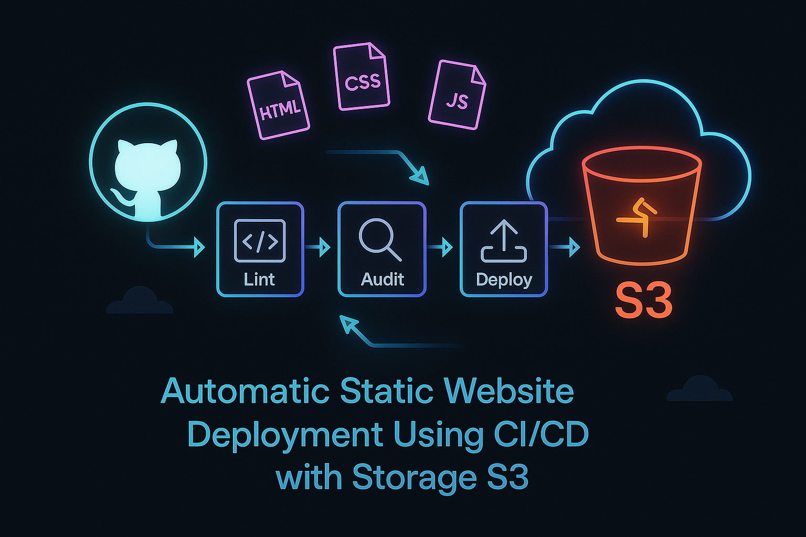

# Auto-Static-Github-S3-Site

# AUTO-STATIC-S3-SITE 🚀

This project showcases a fully automated static website using CI/CD pipelines via GitHub Actions and hosted on AWS S3. Designed as part of my MCA learning journey, it demonstrates cloud-native deployment techniques with clean architecture, live time/date updates, and quality-driven workflows.

## ✨ Features

- Static website built using HTML, CSS, and JavaScript  
- CI/CD pipeline with GitHub Actions for linting and deployment  
- HTMLHint integration to ensure markup quality  
- Real-time display of current time and formatted date using JavaScript  
- Visual architecture diagram to illustrate deployment flow

## 🛠️ Tech Stack

- Frontend: HTML, CSS, JavaScript  
- CI/CD: GitHub Actions (`.yml` workflows)  
- Linting: HTMLHint (`.htmlhintrc`)  
- Hosting: AWS S3 (Static Website Hosting)

## 🌐 Live Site

🌟 Local Development Version  
✅ Hosted on internal machine using VS Code  
📂 Opened directly as `http://127.0.0.1:5500/index.html`  
🛠️ Used for UI testing and debugging

🌐 GitHub Pages Deployment  
🔗 [Live Version](https://sandhya-1301.github.io/Auto-Static-S3-Site/)  
⚙️ Auto-deployed via `static.yml` GitHub Actions workflow  
🧾 Linting enforced using `lint-html.yml`

☁️ AWS S3 Cloud Hosting  
🪣 Bucket Name: `auto-static-s3-site`  
🧭 Public URL: [S3 Endpoint](https://your-bucket-url.s3-website-region.amazonaws.com)  
🔄 Sync enabled using GitHub Actions (or manual upload via AWS Console)  
🔐 Permissions set via bucket policy for public access

## 📚 Learning Outcomes

- Gained hands-on experience with GitHub Actions and `.yml` automation  
- Learned to enforce HTML quality using linting tools  
- Built a modular, visually appealing site with deploy-on-push capability  
- Applied structured DevOps practices to real-world project flows

## 📁 Folder Structure
AUTO-STATIC-S3-SITE/ ├── index.html ├── styles.css ├── script.js ├── images/ │   └── Automatic-Static-Web.png ├── .htmlhintrc └── .github/ └── workflows/ ├── lint-html.yml └── s3-deploy.yml

## 📷 Architecture Diagram

This visual illustrates the automation flow from GitHub commit to S3 deployment:

## 👩‍💻 About Me

I’m **Pilla Sandhya Rani**, currently pursuing my Master of Computer Applications (MCA) with a focus on cloud computing, DevOps, and web automation. This project is part of my academic exploration into modern deployment workflows using GitHub Actions and AWS S3.

My goal is to build elegant, functional web solutions that are not only visually effective but also technically robust and scalable. Through this project, I’m learning how automation streamlines software delivery — turning simple static sites into continuously deployed cloud experiences.

I’m passionate about:
- Designing clean, responsive UIs using HTML, CSS, and JavaScript  
- Exploring CI/CD pipelines to automate deployments  
- Expanding my knowledge in cloud-native tools and DevOps practices

This repository reflects both my learning progress and my commitment to building meaningful, deployable software as part of my academic and professional growth.

## 📬 Contact

Built with ❤️ by **Pilla Sandhya Rani** — MCA student and aspiring cloud developer  
📧 Contact: [Add your email or LinkedIn link here]